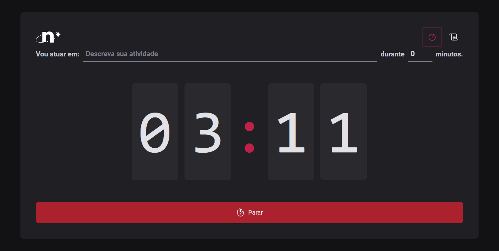

<h1>Pomodoro App</h1>

<p align="center">
  <a href="#project">Project</a>&nbsp;&nbsp;&nbsp;|&nbsp;&nbsp;&nbsp;
  <a href="#technologies">Tecnologies</a>&nbsp;&nbsp;&nbsp;|&nbsp;&nbsp;&nbsp;
  <a href="#usage">Usage</a>&nbsp;&nbsp;&nbsp;|&nbsp;&nbsp;&nbsp;
</p>

<h2 id="project"> Project</h2>

The Pomodoro Technique is one of the most deceptively simple and effective productivity tools I've ever used. It stops you from procrastinating or getting distracted, so you can just get things done—and all it takes is enough commitment to start a timer. <br/>



<h2 id="technologies"> Tecnologies</h2>

- React
- ReactDOM
- React Hook Forms
- Styled Components
- TypeScript
- Vite

<h2 id="usage">Usage</h2>

The application is available for use [here](https://pomodoro-app-blue-tau.vercel.app/).

1. Clone the project:

```
$ git clone https://github.com/torrhes/pomodoro-app.git
```

2. Access the project folder:

```
$ cd pomodoro
```

3. Install the dependencies:

```
$ yarn -i
```

4. Inicie o servidor:

```
$ yarn dev
```

<div style="display: flex;">
  <a href="https://www.linkedin.com/in/nayaratorrhes/" target="_blank"></a>
  <a href="mailto:nayaratorrhes@gmail.com"></a>

</div>
